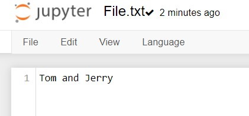
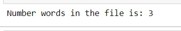

# Word-count
## AIM:
To write a python program for getting the word count from a text.
## EQUIPEMENT'S REQUIRED: 
PC
Anaconda - Python 3.7
## ALGORITHM: 
### Step 1:
Create a file and then open the required file by using the function "with".

### Step 2: 
Assign a variable for 0.
 
### Step 3: 
Then use the for loop for assigning the i value in the file.

### Step 4:  
Use split() to split the words.

### Step 5: 
Using for loop count the number of words.

### Step 6: 
Print the number of words.

## PROGRAM:
```
with open("File.txt","r")as fp:
    count=0
    for data in fp:
        x=data.split()
        for i in x:
            count+=1
        print("Number words in the file is:",count)

```        

### OUTPUT:






## RESULT:
Thus the program is written to find the word count from a text.
